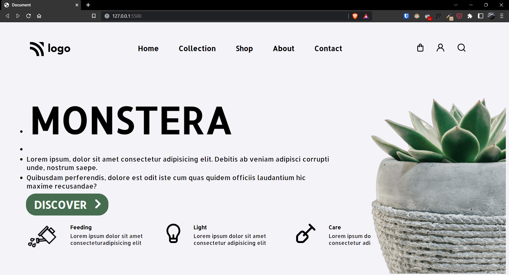

# Project-06 | Plant HomePage

Hi there,
I'm Wasit Ali and this is my 6th project on HTML and CSS in my [web dev bootcamp](https://ineuron.ai/course/Full-Stack-Javascript-Web-Developer).

## ⚒️ Technologies Used

- HTML
- CSS

## 🖥 Preview

`note:` please make sure the preview screen is `1920 x 1080` and the site is not responsive as of now.

[Live Preview](https://flourishing-cupcake-cd4f3a.netlify.app/)

## 👀 What I have learned in this project?

- More about flex-box for elements and handle them.
- Also learnt about buttons and cursers.
- How to use background image with smallers resolution.

## ⏲ Time to finish the project

It took me around 3.30-4.00 hours to complete this project.
